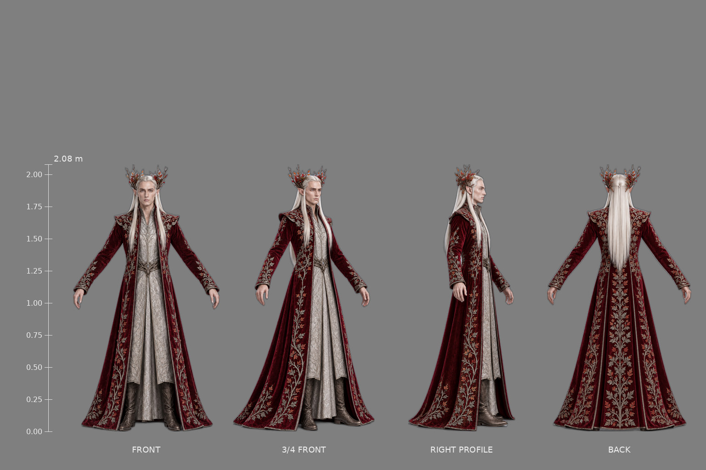
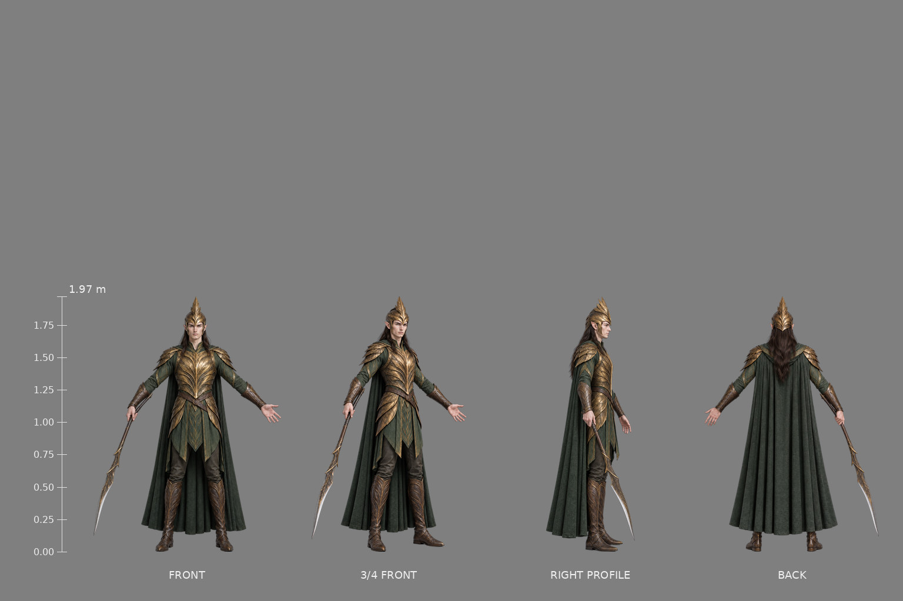
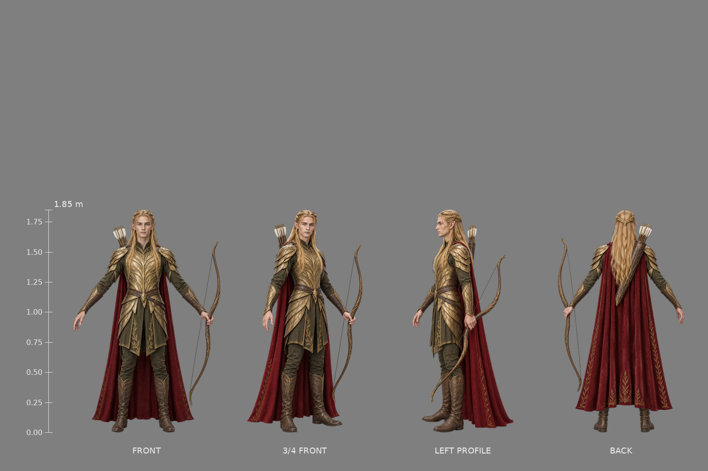
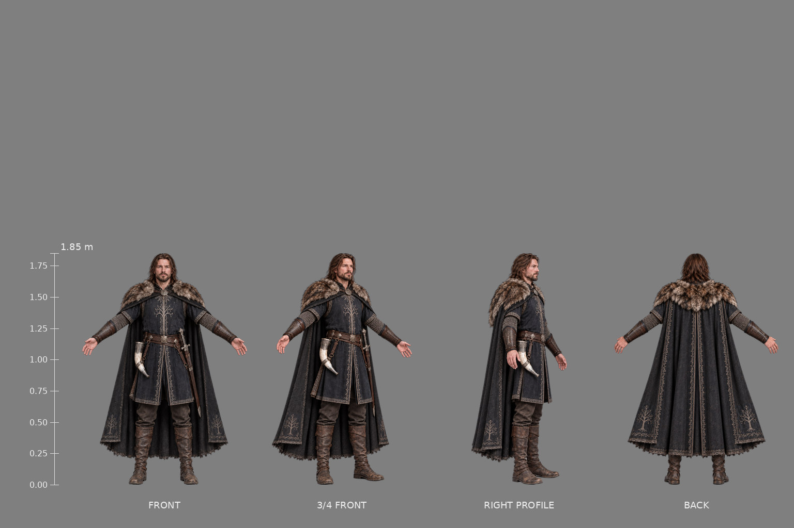
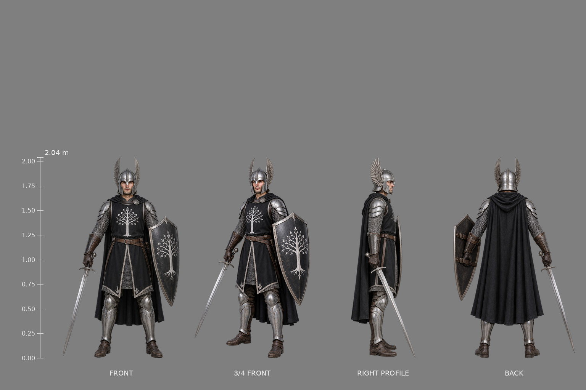
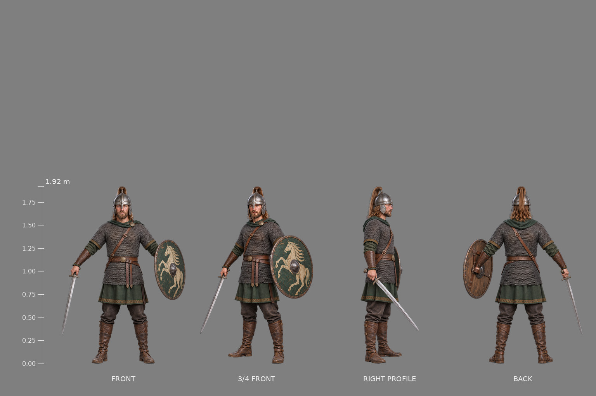

# Greenleaf character reference library

Development references only; the game imports none of these images. All source meshes, textures and sound remain procedural.

Branch `reference/character-sheets`; [draft PR #1](https://github.com/vicciz-ceo/legolas-greenleaf/pull/1). The original briefs are retained in [recovery/original-brief.txt](recovery/original-brief.txt). [CHECKLIST.md](CHECKLIST.md) and [progress.json](progress.json) track every required deliverable and its attempt history.

| Character / group | Design height or span | Thumbnail | Spec | Notes | Delivery status |
| --- | --- | --- | --- | --- | --- |
| legolas | 1.85 | — | [spec](legolas/spec.json) | [notes](legolas/notes.md) | blocked |
| gimli | 1.37 | — | [spec](gimli/spec.json) | [notes](gimli/notes.md) | blocked |
| aragorn | 1.88 | — | [spec](aragorn/spec.json) | [notes](aragorn/notes.md) | blocked |
| tauriel | 1.78 | — | [spec](tauriel/spec.json) | [notes](tauriel/notes.md) | blocked |
| bolg | 2.6 | — | [spec](bolg/spec.json) | [notes](bolg/notes.md) | blocked |
| cave_troll | 4.5 | — | [spec](cave_troll/spec.json) | [notes](cave_troll/notes.md) | blocked |
| thranduil | 1.9 |  | [spec](thranduil/spec.json) | [notes](thranduil/notes.md) | accepted |
| elf_mirkwood | 1.85 |  | [spec](elf_mirkwood/spec.json) | [notes](elf_mirkwood/notes.md) | accepted |
| elf_galadhrim | 1.85 |  | [spec](elf_galadhrim/spec.json) | [notes](elf_galadhrim/notes.md) | accepted |
| boromir | 1.85 |  | [spec](boromir/spec.json) | [notes](boromir/notes.md) | accepted |
| gondor | 1.82 |  | [spec](gondor/spec.json) | [notes](gondor/notes.md) | accepted |
| rohirrim | 1.8 |  | [spec](rohirrim/spec.json) | [notes](rohirrim/notes.md) | accepted |
| laketown_man | 1.75 | — | [spec](laketown_man/spec.json) | [notes](laketown_man/notes.md) | pending |
| orc | 1.7 | — | [spec](orc/spec.json) | [notes](orc/notes.md) | pending |
| goblin | 1.48 | — | [spec](goblin/spec.json) | [notes](goblin/notes.md) | pending |
| gundabad | 2.1 | — | [spec](gundabad/spec.json) | [notes](gundabad/notes.md) | pending |
| uruk | 2.0 | — | [spec](uruk/spec.json) | [notes](uruk/notes.md) | pending |
| berserker | 2.1 | — | [spec](berserker/spec.json) | [notes](berserker/notes.md) | pending |
| lurtz | 2.1 | — | [spec](lurtz/spec.json) | [notes](lurtz/notes.md) | pending |
| easterling | 1.8 | — | [spec](easterling/spec.json) | [notes](easterling/notes.md) | pending |
| haradrim | 1.8 | — | [spec](haradrim/spec.json) | [notes](haradrim/notes.md) | pending |
| war_troll | 4.5 | — | [spec](war_troll/spec.json) | [notes](war_troll/notes.md) | pending |
| mirkwood_spider | 2.75 | — | [spec](mirkwood_spider/spec.json) | [notes](mirkwood_spider/notes.md) | pending |
| brood_mother | 6 | — | [spec](brood_mother/spec.json) | [notes](brood_mother/notes.md) | pending |
| mumak | 14 | — | [spec](mumak/spec.json) | [notes](mumak/notes.md) | pending |
| gundabad_bat | 7 | — | [spec](gundabad_bat/spec.json) | [notes](gundabad_bat/notes.md) | pending |
| great_eagle | 10 | — | [spec](great_eagle/spec.json) | [notes](great_eagle/notes.md) | pending |
| fell_beast | 12 | — | [spec](fell_beast/spec.json) | [notes](fell_beast/notes.md) | pending |
| dwarf_bald | 1.35 | — | [spec](dwarf_bald/spec.json) | [notes](dwarf_bald/notes.md) | pending |
| dwarf_hat | 1.3 | — | [spec](dwarf_hat/spec.json) | [notes](dwarf_hat/notes.md) | pending |
| dwarf_elder | 1.37 | — | [spec](dwarf_elder/spec.json) | [notes](dwarf_elder/notes.md) | pending |
| dwarf_redbeard | 1.4 | — | [spec](dwarf_redbeard/spec.json) | [notes](dwarf_redbeard/notes.md) | pending |
| weapons | supplement | — | — | — | pending |
| orc_variants | supplement | — | — | — | pending |
| dwarf_company | supplement | — | — | — | pending |
| mumak_howdah | supplement | — | — | — | pending |

## Composition and storage

Retained library size: **13,251,189 bytes / 70,000,000 bytes**. Per-character budget: 2,500,000 bytes including all retained sources, finals, JSON and notes. Full-resolution originals stay outside the committed reference library in `/workspace/generated_images`; `sources.json` records provenance. Temporary previews and Python bytecode are not retained assets.

Commands: `python docs/refs/tools/compose.py check <id>` and `python docs/refs/tools/compose.py check --all`. A whole-library PARTIAL result lists missing, rejected or blocked sets rather than certifying them.

Minor buckle, stitching, strap-count and light drift is tolerated and documented per character. No source is mirrored. Creature views, flight silhouettes and supplements follow their explicitly recorded exceptions.
